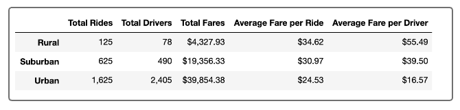
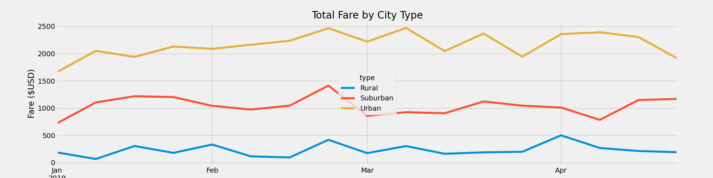

# PyBer_Analysis Module 5

## Overview of Analysis
We were tasked with building a multiple-line graph that showed the total weekly fares for each city type (Rural, Urban, Suburban).

## Results

As we can see from the Image above, there are some differences among the different metrics we created in our Dataframe. 

We can see that there were the most rides given in the Urban city type, followed by Suburban and then Rural. Naturally, the total fares follow the same ranking. 

When we look at the Average Fare per Ride, we see that the Rural fares are on average more than the Suburban fares and Urban fares. This would presumably be due to the total distance traveled for each ride. Urban fares may be blocks, suburban a few miles, and rural would generally be longer which would lead to the higher Average Fare per Ride. 

Next we will look at Drivers. Urban areas are full of drivers, in fact more drivers than there were total rides. This leads to a lower Average Fare per Driver. Per our Dataframe, the Average Fare per Driver is only $16.57 for Urban areas.

In rural and suburban areas, we see that there are more rides than there are drivers, which ultimately leads to a higher Average Fare per Driver than the Urban areas. For Suburban areas, the Average Fare per Driver is $39.50 and in Rural the Average Fare per Driver is $55.49.

## Summary

We have created the multiple-line graph to show the Weekly Total Fares by City Type. As we stated above, since there are more rides for the Urban locations, we do see a higher weekly total fare volume. Suburban is second in weekly total fares, and rural is last. Below I will summarize 3 suggestions for the CEO.

### First Suggestion
To address the average fares per driver, perhaps you could offer some incentives or inform your drivers that there are opportunities to gain more fares by working in suburban or rural areas instead of driving in the urban areas all the time. Currently the Urban areas have more drivers than they do possible rides which limits the opportunity that drivers have. 

### Second Suggestion
We can also look at creating some graphs to see what days of the week that rides are most common and break that down by city type. Are weekends more popular in the city? Is ride volume more consistent day to day in rural areas? 

### Third Suggestion
Ultimately as CEO you have to weigh your success on a few factors. Keeping the customers happy, keeping your employees happy, and making profit could be some of those factors. Depending on what your key metric is, we can come up with ways to improve the metric. Perhaps if you are looking for more drivers to drive in rural areas because the average pick-up time is longer (less drivers for each ride), you can offer bonuses to your drivers in order to improve pick-up time for your customers. 

